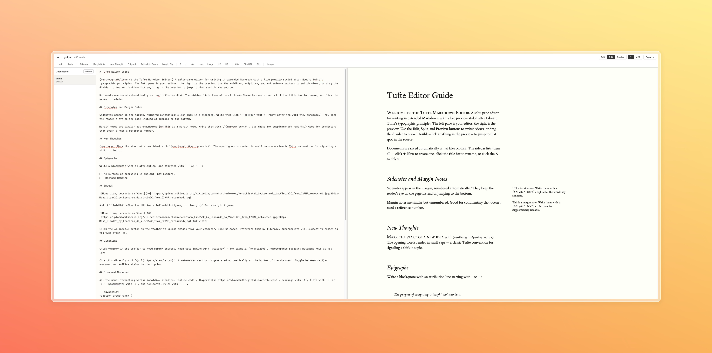

# Tufte Editor

A distraction-free Markdown editor with live preview, styled with [Edward Tufte's CSS](https://edwardtufte.github.io/tufte-css/). Get to writing fast, with simple, clean typography.



Documents are plain `.md` files on disk. Images are regular files. No build step, no dependencies, no accounts — just `node server.js` and write.

🤖 Full disclosure: This project was built entirely through conversation with Claude (Anthropic). I designed the concept, workflow, and feature set; Claude wrote all the code. I am not a JavaScript developer. The code has not been independently audited. Contributions, code review, and bug reports are very welcome!

⚠️ Local use only. This editor runs an unauthenticated HTTP server. It is designed for personal use on your own machine — do not expose it to the public internet or untrusted networks. There is no login, no access control, and no encryption. Anyone who can reach the server can read, edit, and delete your documents.

## Quick start

```
git clone <repo-url> && cd tufte
node server.js
```

Open [http://localhost:3000](http://localhost:3000). Two starter documents are included to get you oriented.

## Features

**Writing**
- Split-pane editor with live Tufte-styled preview
- Sidenotes, margin notes, epigraphs, and new-thought markers
- Image uploads 
- BibTeX citations with autocomplete and numbered/APA styles
- Double-click anywhere in the preview to jump to that spot in the editor
- Keyboard shortcuts for bold, italic, undo/redo, and save
- Latex support
- Code blocks with syntax highlighting

**Documents**
- Multi-document sidebar with create, rename, and delete
- Auto-save as you type — every document is a `.md` file in `docs/`
- Uploaded images stored as files in `uploads/`

**Export**
- Standalone HTML with Tufte CSS and inlined images
- Print / PDF via browser dialog
- Copy raw Markdown to clipboard

## Project structure

```
tufte/
  server.js       Zero-dependency Node.js server
  index.html      Single-page app shell
  editor.js       App logic, toolbar, sidebar, modals
  parser.js       Markdown-to-HTML with Tufte extensions
  documents.js    Document CRUD (talks to server API)
  images.js       Image store (talks to server API)
  citations.js    BibTeX parsing and citation rendering
  style.css       Editor UI styles
  docs/           Your documents (Markdown files)
  uploads/        Your uploaded images
  test.js         Integration tests
```

## Tufte Markdown syntax

Standard Markdown plus:

| Syntax | Renders as |
|--------|------------|
| `{sn:text}` | Numbered sidenote in the margin |
| `{mn:text}` | Unnumbered margin note |
| `{newthought:words}` | Opening words in small caps |
| `> quote` / `> — Author` | Epigraph with attribution |
| `![caption][50](https://upload.wikimedia.org/wikipedia/commons/thumb/e/ec/Mona_Lisa%2C_by_Leonardo_da_Vinci%2C_from_C2RMF_retouched.jpg/300px-Mona_Lisa%2C_by_Leonardo_da_Vinci%2C_from_C2RMF_retouched.jpg)` | Image at 50% width |
| `![caption][100](https://upload.wikimedia.org/wikipedia/commons/thumb/a/a7/Camille_Pissarro_-_Boulevard_Montmartre_-_Eremitage.jpg/1280px-Camille_Pissarro_-_Boulevard_Montmartre_-_Eremitage.jpg){fullwidth}` | Full-width figure |
| `![caption][100](https://upload.wikimedia.org/wikipedia/commons/thumb/4/4f/Feather_pen.svg/240px-Feather_pen.svg.png){margin}` | Margin figure |
| `@citekey` | Inline citation |
| `@url[https://...]` | URL citation |

## Tests

```
node test.js
```

## Requirements

Node.js 18 or later. No `npm install` needed.

## License

[CC BY-NC 4.0](LICENSE) — Free to use, share, and adapt for non-commercial purposes.
